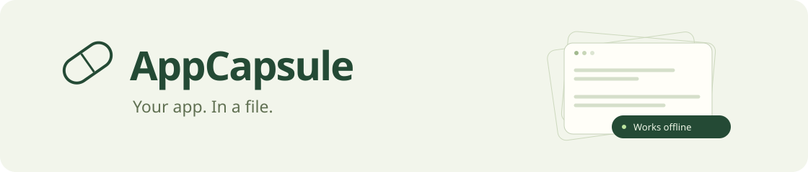

<p align="center">
  
</p>

<p align="center">
  <a href="https://github.com/carlogiovannifalocco-byte/appcapsule/actions/workflows/ci.yml"></a>
  <a href="LICENSE"></a>
  <a href="https://github.com/carlogiovannifalocco-byte/appcapsule/releases"></a>
</p>

**Turn your Vite app into an interactive HTML file that works offline.**

Record a journey. Bundle the real frontend and its captured API responses. Run the same journey with the network disabled. Send the resulting file to someone who has a browser.

No account. No hosted backend for playback. No AI API key.

**[Download a working demo](https://github.com/carlogiovannifalocco-byte/appcapsule/releases/latest/download/signal.html)** · **[Get the release](https://github.com/carlogiovannifalocco-byte/appcapsule/releases)** · [Compatibility](docs/compatibility.md) · [Italiano](docs/README.it.md)


[Watch the offline walkthrough](docs/demo.webm) · [Full-size screenshot](docs/signal.png)

## Try it in two minutes

Requires **Node.js 22.12+** and npm. Chromium is needed to create and verify capsules; viewers only need a modern browser.

```sh
git clone https://github.com/carlogiovannifalocco-byte/appcapsule.git
cd appcapsule
npm ci
npx playwright install chromium
npm run build
npm run demo
```

Open `capsules/signal.html` by double-clicking it. Search projects, open their details, filter the collection, check tasks, or create a temporary project. The demo script has already stopped its server.

Want a smaller example? Run `npm run demo -- catalog` for a vanilla JavaScript/XHR catalog, or `npm run demo -- fieldbook` for a hash-routed reading app. Every sample uses fictional data.

## Capture your app

Install the prebuilt package from a GitHub release in your Vite project:

```sh
npm install --save-dev https://github.com/carlogiovannifalocco-byte/appcapsule/releases/download/v0.1.0/appcapsule-0.1.0.tgz
npx playwright install chromium
npx appcapsule init
```

Start your app in another terminal, using a synthetic-data environment. Edit `appcapsule.config.mjs`:

```js
export default {
  url: 'http://localhost:5173',
  project: '.',
  out: 'capsules/demo.html',
  title: 'My app',
  scenario: './capsule.journey.mjs',
  redactKeys: ['email', 'phone'],
};
```

Write a journey with assertions about what should work:

```js
export default async function ({ page, expect }) {
  await page.getByRole('button', { name: 'Open dashboard' }).click();
  await expect(page.getByRole('heading', { name: 'Dashboard' })).toBeVisible();
  await page.getByRole('textbox', { name: 'Search' }).fill('design');
  await expect(page.getByText('Design system')).toBeVisible();
}
```

```sh
npx appcapsule capture
```

The command creates `demo.html` and `demo.html.report.json` **only after offline verification succeeds**. The report contains a SHA-256 digest of the exact HTML checked, the fixtures exercised, misses, errors, and attempted external requests.

To explore manually, omit `scenario` from your config. Capture opens a fresh browser; browse the intended screens and return to the terminal. This mode performs a **startup check only**, explicitly labelled in the report. It does not claim your interactions were tested.

## What travels with the file?

- Your production frontend: real JavaScript, CSS, and supported embedded assets.
- The captured GET/HEAD JSON or text responses needed by the recorded path.
- A small runtime that answers recorded requests locally and reports unsupported actions.
- An accessible, keyboard-operable panel showing captured and replayed response counts.

AppCapsule does not export a backend. Client-side interactions still work; new server-side behavior does not appear by magic. It is particularly useful for portfolios, UI reviews, product walkthroughs, and shareable examples.

## Scope of the first release

| Supported                                                           | Outside v0.1                                                  |
| ------------------------------------------------------------------- | ------------------------------------------------------------- |
| A local, single-entry Vite SPA; React and vanilla examples included | Arbitrary third-party websites, SSR and multi-page apps       |
| Root URL and hash routing                                           | History/path routing                                          |
| GET/HEAD through fetch and a documented async XHR subset            | HTTP writes, GraphQL POST, streaming and binary API bodies    |
| Stable JSON/text responses                                          | Different responses for the same request, live authentication |
| Bundled JS/CSS, imported assets, supported static public resources  | `srcset`, workers, WebSockets, remote embeds                  |
| Offline verification in Chromium                                    | A guarantee about unvisited states or every browser           |

See the [full compatibility contract and troubleshooting guide](docs/compatibility.md).

## Privacy has an explicit boundary

Use **fictional or disposable demo data**. API request headers, cookies, and browser storage are not copied. Common secret-shaped JSON keys are redacted, sensitive URL query keys are rejected, and recognizable token/private-key patterns stop the export. Add application-specific keys with `redactKeys`.

These checks are not complete secret or personal-data detection. Your bundled frontend and captured response bodies are readable by recipients. Review them before sharing. The runtime and CSP prevent supported code paths from contacting a live backend; **this is not a sandbox for malicious application code**. Read the [security model](SECURITY.md).

## CLI and library

```sh
appcapsule capture --url http://localhost:5173 --project . --scenario journey.mjs --out demo.html
appcapsule verify demo.html --scenario journey.mjs --json
appcapsule inspect demo.html --json
appcapsule --help
```

Existing exports are protected unless you pass `--force`. Limits default to 2 MB per API response, 20 MB of captured response data, 500 distinct responses, and 30 seconds per journey.

```js
import { capture, verify } from 'appcapsule';

const result = await capture({
  url: 'http://localhost:5173',
  project: '.',
  out: 'capsules/demo.html',
  scenario: './journey.mjs',
});
console.log(result.report.passed);
```

[Configuration reference](docs/configuration.md) · [Architecture](docs/architecture.md) · [Contributing](CONTRIBUTING.md)

## Development

```sh
npm ci
npx playwright install chromium
npm run check
npm run demo -- --all
```

The test suite exercises production bundling, offline journeys, mobile layout, keyboard access, accessibility rules, XHR behavior, blocked writes, missing fixtures, content security policy, injection escaping, redaction, and failed verification. CI runs on Linux, Windows, and macOS.

## Where this can go

The next useful steps are explicit fixtures for stateful demos, more asset formats, optional automatic journey recording, and broader browser coverage. See [the roadmap](docs/roadmap.md). Compatibility expansions should come with reproductions and offline tests.

MIT licensed. Built around Vite, Playwright, and parse5. Inspired by the portability of SingleFile and the web-archiving work of Webrecorder; AppCapsule focuses on source-owned Vite apps and testable demo journeys. No code was copied from those projects.
