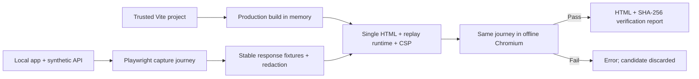

# Architecture

## Capture

`capture.ts` validates the local entry URL and output path, builds the project in memory, and starts a fresh browser context without saved authentication. HTTP writes are aborted. JSON/text fetch and XHR responses from allowed origins are collected, bounded, normalized, redacted and deduplicated. Conflicting responses fail instead of choosing an arbitrary result.

`bundle.ts` uses Vite's build API and parse5 to embed the generated JS/CSS and supported local resources. It checks real paths for public resources. It injects the escaped JSON manifest, runtime, and content security policy at the beginning of the document head.

## Playback

`runtime.ts` is bundled as a small standalone IIFE. It resolves requests against the recorded app origin, serves fresh Response objects, implements the supported async XHR surface, and exposes diagnostic events. A shadow-root dock keeps the information panel separate from app styles. No CDN, service worker or local server is necessary for playback.

Diagnostic events: `appcapsule:replay` and `appcapsule:miss`, both carrying `{ key }` in `detail`. `window.__APPCAPSULE__` exposes hit/miss arrays for the verifier. This is observability for trusted demos, not tamper-resistant monitoring.

## Verification and output

`verify.ts` parses the manifest, opens the actual `file:` URL in an offline browser context and additionally aborts any observed external HTTP(S) request. It runs the journey, collects browser errors and runtime diagnostics, and hashes the exact file. The capture candidate lives in a temporary directory and is removed on either outcome. A failed verification does not replace an existing export.

Existing outputs use exclusive creation unless overwrite was explicit. Overwrites use a temporary sibling and a rename. The companion JSON report is written after the HTML; the pair is not an atomic filesystem transaction. A failed report write is surfaced as an error.

## Boundaries worth preserving

- Keep transport data separate from executable runtime code. Serialize user values with `safeJson` and render labels with `textContent`.
- A fixture miss must fail visibly. Never fall back to a live request.
- Keep startup-only and journey verification distinct.
- Avoid capability claims broader than the tests and documented contract.
- Do not expand to stateful APIs without an explicit model for request identity and response state.
