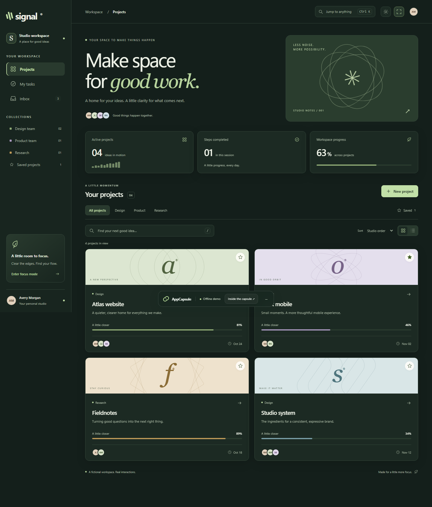
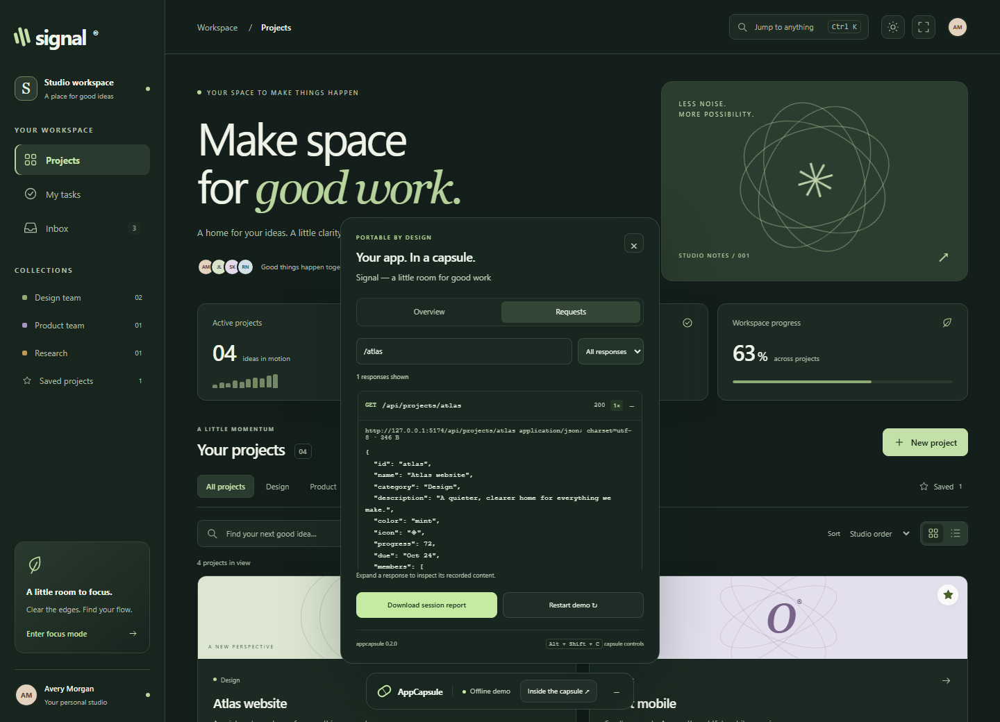

# Explore a capsule

Every exported capsule includes its own controls. The Signal sample demonstrates a richer workspace built entirely from the bundled frontend and five recorded API responses.

## Signal workspace

- Search project names, descriptions and collections. Combine collection and saved filters, or reset them from an empty result.
- Save a project with its star, choose a grid or list, and sort by name or progress.
- Open a project, complete its next steps or add your own. Progress updates immediately. Completed steps contribute to the project's recorded starting progress.
- Create a project with a name, description, collection and color. Undo its creation from the notification.
- Add personal tasks and filter completed or remaining work. Task creation also supports undo.
- Open an inbox update to see its project. Mark everything read and undo if needed.
- Choose light or dark mode. Focus mode removes the sidebar, welcome area and summary to give your work more space.

Signal uses fictional data. Edits, theme, saved projects and view preferences last only for this session. Reloading restores the original sample. Other exported apps retain their own frontend behavior; AppCapsule does not implement their backend writes.

## Keyboard controls

| Shortcut          | Action                                             |
| ----------------- | -------------------------------------------------- |
| Ctrl K / ⌘ K      | Open Signal's project and action menu              |
| ↑ / ↓, then Enter | Select and run a menu result                       |
| /                 | Focus project search when outside a form or dialog |
| Escape            | Close the active dialog or focused capsule panel   |
| Alt Shift C       | Toggle capsule details when no app dialog is open  |
| Tab / Shift Tab   | Move through controls                              |

Dialogs keep keyboard focus inside while open. Motion follows the operating system's reduced-motion preference.

## Capsule explorer

**Overview** shows response counts, local replays, blocked actions and response coverage for this session. These counters do not certify the whole app: a session can use only some recorded paths.

**Requests** searches method, URL, status and content type. Filter all, replayed, unused or blocked requests. Expand a response to inspect its content; previews are limited to 16,000 characters and JSON is formatted when small enough. Content is rendered as text, never interpreted as HTML.

**Download session report** creates a local JSON file containing endpoint metadata, byte sizes, replay counts and blocked-action identifiers. Response bodies are omitted. URLs and blocked-action text are still included, so the report is not an anonymization tool. For an offline verification result, use `appcapsule verify` and its separate SHA-256-bound report.

**Restart demo** asks before reloading and returning to the recorded hash route. It clears Signal's in-memory edits, but does not erase browser storage used by other applications. **Minimize controls** leaves a small restore button.
